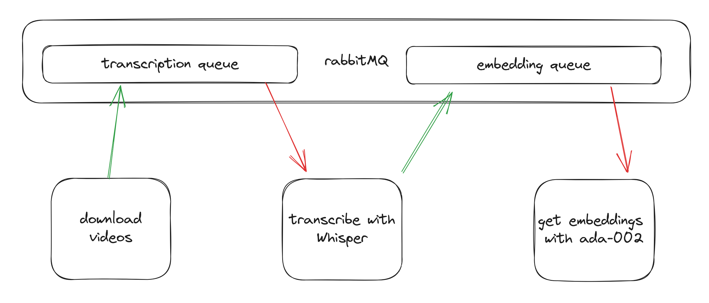
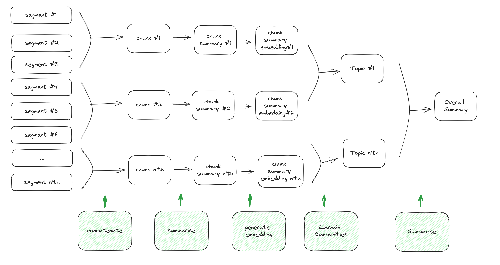

# Video Semantic Search & Topic Summarization (with The Good Doctor)

Search across Youtube videos by generating vector embeddings of its audio, understand hour-long videos in 3 paragraphs using topical summarization with Louvain communities.

Feel free to adapt this code to your own video needs.

## Introduction

**Prerequisites**

1. Ideally you should have a GPU available
2. A ready Supabase DB

### Searching across videos

The general approach here is to download videos from Youtube, use Whisper to transcribe the audio, and finally use an embedding model to generate the vector embeddings of each segment of the transcribed audio.

To achieve this, use the code in `batch/`.



There are 3 main stages to enable vector search across videos. To make it faster and asynchronous, a rabbitmq docker container is used to enable each stage to run independently from one another without having to wait for a longer running process to complete.

1. [Download videos](batch/download.py) from Youtube locally.
2. [Transcribe audio](batch/transcribe.py) into text segments.
3. [Generate segment embeddings](batch/embedding.py) using `ada-002` from OpenAI.

In each of these stages, the results are being uploaded and saved into a Supabase db. It's entirely free and perfect to use for a hobby project. That said, the vector embeddings take up a lot of space and you'll easily exceed the free storage limit. Either use an embedding model with fewer dimensions (like `minilm` from `sentence-transformers`), or run your batch on only a small number of videos and monitor accordingly.

### Generating summaries and topics



The output of the Whisper transcription is a list of segments (with their corresponding vector embeddings) roughly ~10-20 secs in length. To generate the summaries, we utilise these segments. The figure above describes the overall strategy used:

1. The text segments for a given video are concatenated together into chunks.
2. These chunks are then passed into a LM (`gpt-3.5-turbo`) to be summarised.
3. Summarised chunks are then passed into an embedding model to obtain its vector embeddings.
4. Louvain communities algorithm is applied to these summarised chunks to obtain a grouping of topics.
5. The chunks for each grouped topic are passed into a LM to generate a final topic summary and title.
6. Finally, all the topic summaries are passed once more to get an overall summary.

```
    python batch/gen_summary.py
```

## Getting Started

Install and setup the virtual environment.

```
    make init
```

To run the batch process, you need a `.env` file containing:

```
    YOUTUBE_API_KEY=
    OPENAI_API_KEY=
    SUPABASE_DATABASE_PASSWORD=
    SUPABASE_KEY=
    SUPABASE_URL=https://xyz.supabase.co
```

And to run the batch process, simply:

```bash
    make batch PLAYLIST_ID=<YOUR_PLAYLIST_ID>,<ANOTHER_PLAYLIST_ID>

    # clean up
    make clean
```

To run the Next.js 13 webapp, you need a `.env.local` containing:

```
    NEXT_PUBLIC_SUPABASE_URL=
    NEXT_PUBLIC_SUPABASE_ANON_KEY=
    OPENAI_API_KEY=
```

And to run the app,

```bash
    # install deps
    cd yt_search
    npm i

    # run
    npm run dev
```
